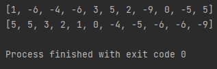
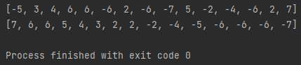
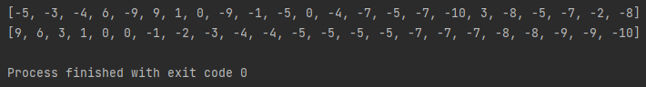

# Объектно-ориентированное программирование, ЛР 3
### Вариант 5
Не используя вспомогательных объектов, переставить отрицательные элементы данного списка в конец, а положительные - в начало этого списка.

## Скриншоты работы программы
 
 

